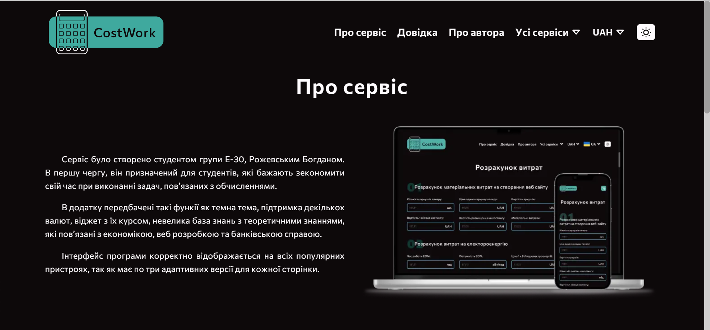
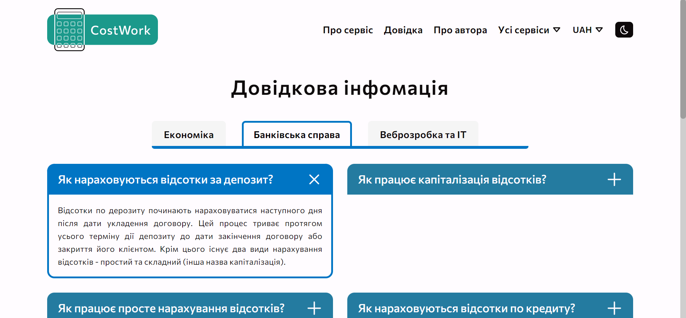
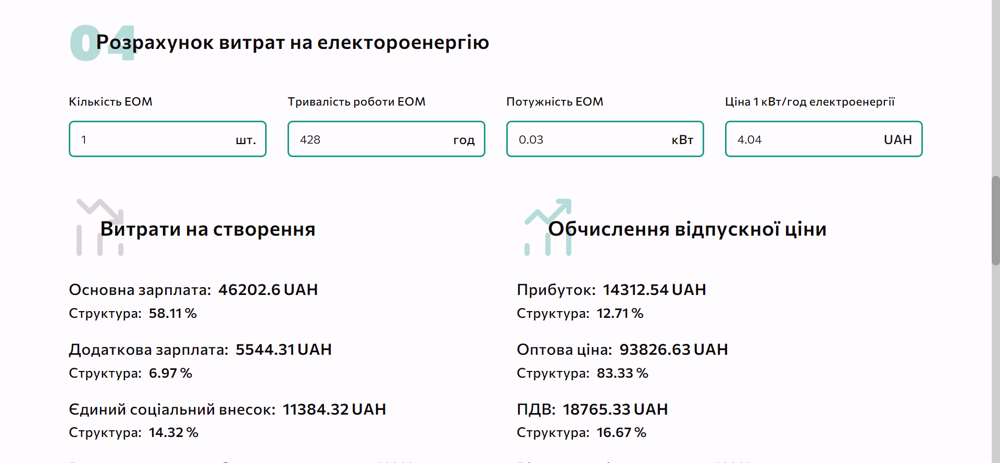
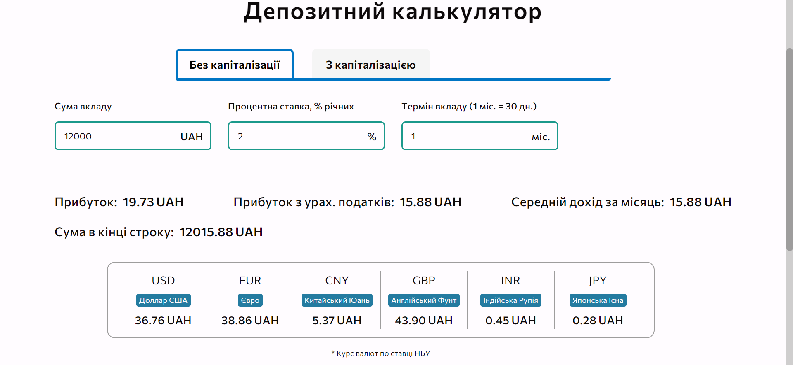
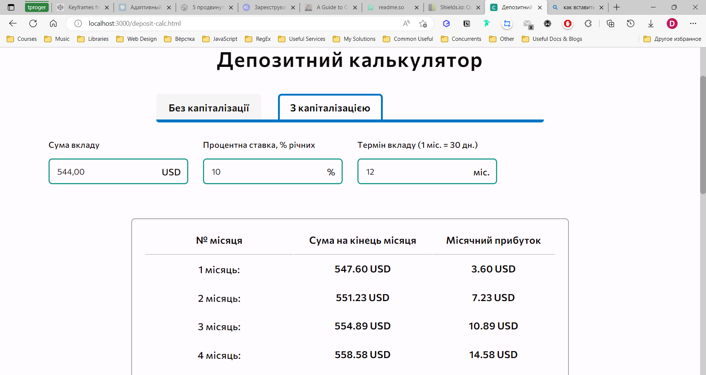
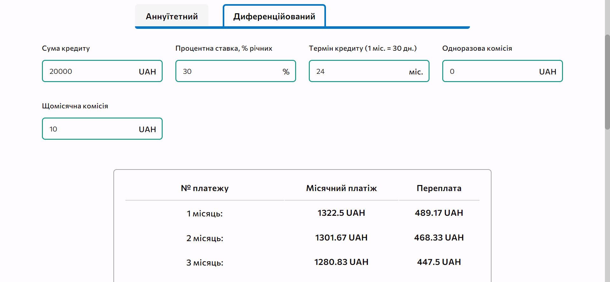
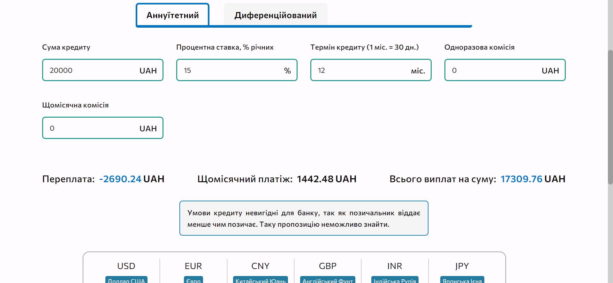

# CostWork

Web app for calculating the cost of creating website, profit from deposit and amount of credit overpayment.

It's a colledge diploma project. Prototype, design and text content was made from scratch at Figma. [View template](https://www.figma.com/file/4knFPhLEZ0sUvWA3p18477/Economy?node-id=0%3A1&t=wt9kcK7fZ9LagRrM-1)

Consist of seven pages:
* Main
* About
* Author
* Faq
* Site calc
* Deposit calc (with two varieties - simple & capitalisation)
* Credit-calc (with two varieties - annuity & differential)

All pages have 3 adaptive versions.

## Features

* Currency rate widget
* Multi-currency support (сonversion all values and results when selecting a currency)
* Dark theme support
* Website cost calc
* Simple deposit calc
* Capitalisation deposit calc
* Annuity credit calc
* Differential credit calc
* Table content toggles (tabs, accordions and etc.)

## Demo

**Main page**


**About page**



**Faq page**



**Deposit calc page**



**Deposit calc page**




**Credit page**




## Usage

I use an improved Gulp-based build taken from this video: [Click](https://youtu.be/qSZvGlIKGPg)

First of all, open project in [VS Code](https://code.visualstudio.com). After that, open terminal.

If you do not have Gulp installed, write the commands:

```bash
  npm i gulp -D

  npm i gulp-cli -D
```

After that, install dependencies:

```bash
  npm i
```

For start the project in development mode:

```bash
  gulp
```

If the project is finished, minify the code and images, use command:

```bash
  gulp --production
```

### Troubleshooting

1. Set VS Code to run as an administrator [Click](https://qastack.ru/programming/37700536/visual-studio-code-terminal-how-to-run-a-command-with-administrator-rights)
2. Open PowerShell with administrator rights and type command: "Set-ExecutionPolicy RemoteSigned" after that displaying confirm dialog, press "Y". This step need for allow execute local scripts in PowerShell.
3. **Node JS v16** and **Gulp v4** is required to work correctly (NodeJS v16.16 and Gulp v4.0.2 is based version).
4. **npm rebuild** - if not all packages are installed after **npm i** command.
5. **npm cache verify** - If after restarting, build doesn't catch changes "on the fly".

### Folder structure

**#src** - source folder.

**z_dist** - project bundle.

In all files in #src folder, write path as like **from z_dist** folder.

```
project
│   readme.md
│   package.json 
|   package-lock.json
|   gulpfile.js
|   .gitignore
|   .eslintrc.json
│
└───blob                          # Demo images
|
└───#src
│   └───fonts                     # Fonts in .ttf, .otf format
│   │
│   └───html                      # All .html files
│   |   └───components            # Components layout (e.g. _news-card.html)
|   |
│   └───img                       # All images
|   |   └───...    
|   |
│   └───js                        # All .js files
│   |   └───calc                  # Business logic
│   |   └───common                # Reusable function and common functionality
│   |   └───components            # Components logic
│   |   └───data                  # For saving reusable data objects
|   |       script.js             # For import files
|   |
|   └───json                      # All .json files
|   |   └───...
|   |
|   └───scss                      # All .scss files
|       └───base                  # Basic stylisation files (vars, null, fonts etc.)
|       └───components            # Components styles
|       └───pages                 # Pages styles
|       |   style.scss            # For import all styles
│   
└───z_dist                        # Project bundle
|   └───css
|   └───fonts
|   └───img
|   └───js
|   *.html
|
└───config                        # Config build files (path & plugin settings)
|
└───docs (optional)               # Informational files
|
└───tasks                         # Tasks for processing different file types
|
└───node_modules
    └───...
```
